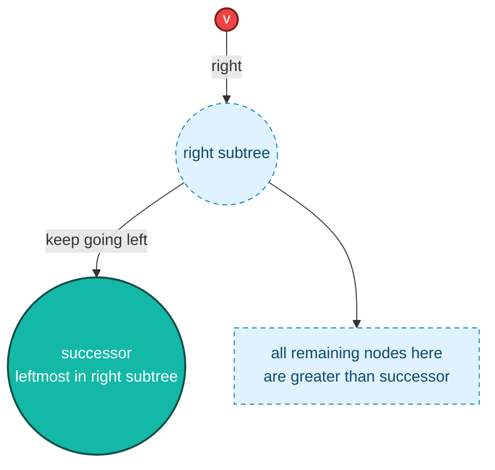
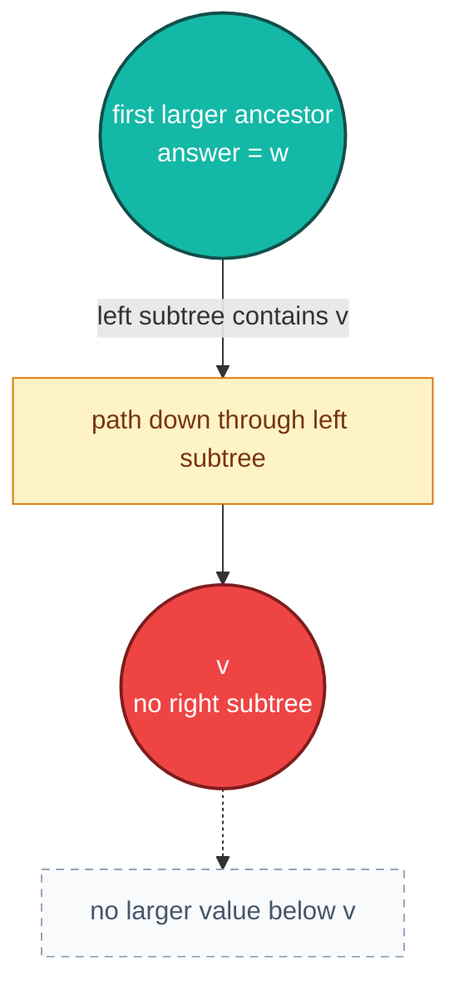
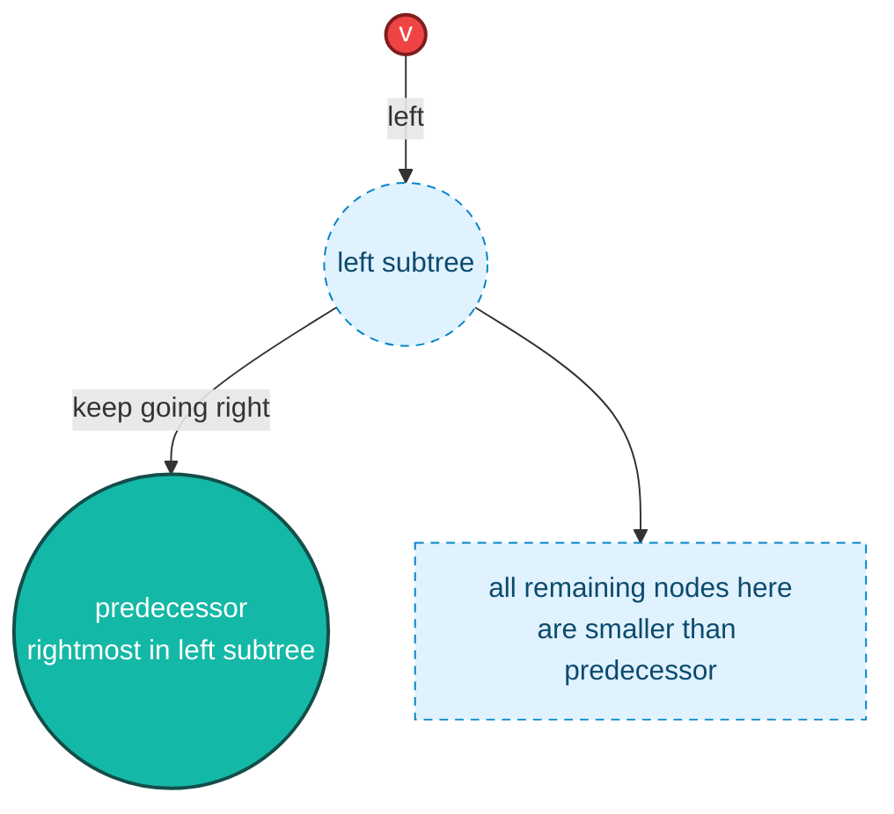

# BST Query Operations

> [!summary]
> BST 查询操作的共同模式是：从 root 出发，根据当前 key 和目标值的大小关系，决定向左、向右，或者停止。  
> 除遍历外，大多数查询复杂度都是 `O(h)`，其中 `h` 是树高。

> [!tip] Visual Legend
> Red = 当前查询的节点 `v`，Teal = 查询答案，Blue = 候选子树或普通子树。

## Search(v)

```text
cur = root
while cur != null:
    if v == cur.key: found
    if v < cur.key: cur = cur.left
    if v > cur.key: cur = cur.right
not found
```

搜索能跳过一整棵不可能包含答案的子树。

> [!tip] Implementation Jump
> 内部搜索函数看 [[09-1 Cpp Node and Utilities#Internal Search Helpers|findNode / minNode / maxNode]]；公开查询接口看 [[09-2 Cpp BST Query Operations#Contains and Count|contains and count]]。

## lower_bound(v)

`lower_bound(v)` 返回 BST 中第一个 `>= v` 的 key。

- 如果 `v` 存在，答案就是 `v`。
- 如果 `v` 不存在，答案是比 `v` 大的最小 key。
- 如果所有 key 都小于 `v`，答案不存在。

实现技巧：从 root 往下走，遇到 `cur.key >= v` 就记录候选答案，并继续向左尝试找更小的可行值。

> [!tip] Implementation Jump
> 完整代码看 [[09-2 Cpp BST Query Operations#lowerBound|C++ lowerBound]]。

## Min() and Max()

- `Min()`: 从 root 一直走 `left`，直到不能再走。
- `Max()`: 从 root 一直走 `right`，直到不能再走。

复杂度都是 `O(h)`。

> [!tip] Implementation Jump
> 完整代码看 [[09-2 Cpp BST Query Operations#Min and Max|C++ min and max]]。

## Successor(v)

`Successor(v)` 是严格大于 `v` 的最小 key。

有三种情况：

- 如果 `v` 有右子树，答案是右子树中的 `Min()`。
- 如果 `v` 没有右子树，就向上找第一个「从左边走上来」的祖先。
- 如果 `v` 已经是最大值，则没有 successor。

不使用 parent pointer 时，也可以从 root 搜索 `v`，同时维护「当前见过的最小的大于 `v` 的节点」。

Case A: `v` has a right subtree, so successor is the leftmost node in that right subtree.



Case B: `v` has no right subtree, so go up until the first ancestor where the path came from the left.



> [!tip] Implementation Jump
> 完整代码看 [[09-2 Cpp BST Query Operations#Successor and Predecessor|C++ successor and predecessor]]。

## Predecessor(v)

`Predecessor(v)` 是严格小于 `v` 的最大 key，是 successor 的镜像：

- 如果 `v` 有左子树，答案是左子树中的 `Max()`。
- 如果 `v` 没有左子树，就向上找第一个「从右边走上来」的祖先。
- 如果 `v` 已经是最小值，则没有 predecessor。

Mirror intuition:



> [!tip] Implementation Jump
> 完整代码看 [[09-2 Cpp BST Query Operations#Successor and Predecessor|C++ successor and predecessor]]。

## Links

- Back to [[Binary Search Tree]]
- Previous: [[02 BST Core Concepts]]
- Next: [[04 BST Update Operations]]
- Related: [[08 Traversal Rank Select]]
- Related: [[BST AVL Cheat Sheet]]
