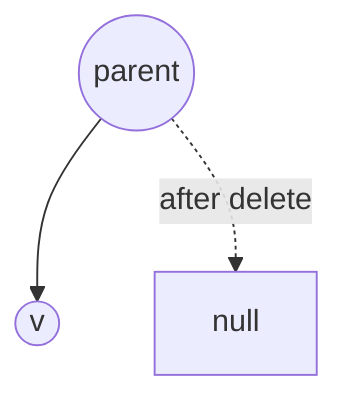
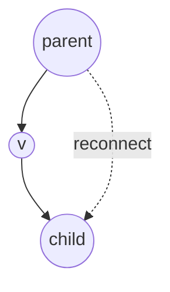
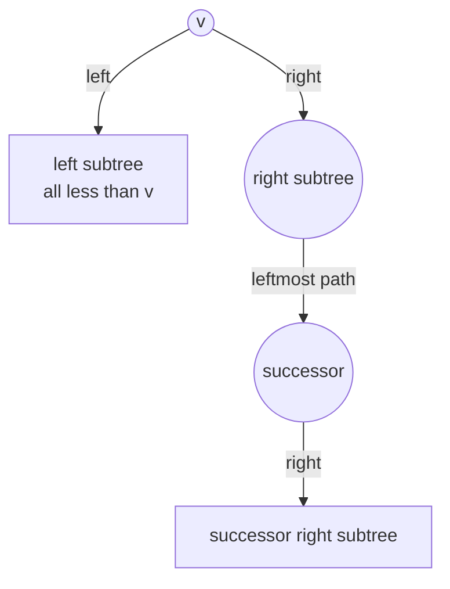
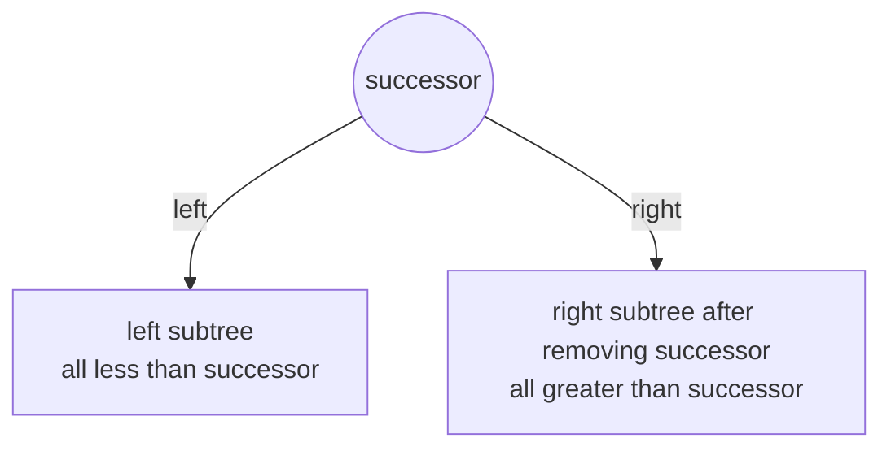

# BST Update Operations

> [!summary]
> BST 更新操作会改变树结构。普通 BST 的 `Insert` 和 `Remove` 都是 `O(h)`，但如果树退化成链，`h` 可能达到 `N - 1`。

## Insert(v)

插入和搜索很像：

1. 从 root 开始搜索 `v`。
2. 如果遇到相同 key，说明是重复插入，直接 `freq++`。
3. 如果走到 `null`，就在这个位置新建节点。

插入位置一定是某个 leaf 的左孩子或右孩子。

> [!tip] Implementation Jump
> 完整代码看 [[09-3 Cpp BST Insert and Remove#Insert|C++ Insert implementation]]。

## Remove(v)

删除前先执行一次 search：

- 如果 `v` 不存在，什么都不做。
- 如果 `freq > 1`，只需要 `freq--`，树结构不变。
- 如果 `freq == 1`，进入结构性删除。

> [!tip] Implementation Jump
> 删除主流程看 [[09-3 Cpp BST Insert and Remove#Remove Overview|C++ Remove overview]]。

## Case 1: Leaf

如果要删除的节点是 leaf，直接断开它和 parent 的连接。



这一部分是 `O(1)`，但前面的搜索仍然是 `O(h)`。

> [!tip] Implementation Jump
> leaf 删除在 [[09-3 Cpp BST Insert and Remove#Remove Case 1 and Case 2|Remove Case 1 and Case 2]] 中由 `transplant(node, node->right)` 覆盖。

## Case 2: One Child

如果节点只有一个孩子，把这个孩子接到被删除节点的 parent 上。



本质是绕过当前节点：

```text
parent -> node -> child
parent --------> child
```

这一部分也是 `O(1)`。

> [!tip] Implementation Jump
> one-child 删除看 [[09-3 Cpp BST Insert and Remove#Remove Case 1 and Case 2|C++ Remove Case 1 and Case 2]]。

## Case 3: Two Children

如果节点有两个孩子，不能直接删除，否则左右子树会断开。常见做法：

1. 找到当前节点的 successor，也就是右子树的最小节点。
2. 用 successor 的 key / freq 替换当前节点。
3. 在右子树中删除原 successor 节点。

为什么合法：

- successor 大于左子树所有 key。
- successor 是右子树中最小的 key，所以右子树剩余 key 都大于 successor。
- 替换后仍满足 `left < root < right`。

也可以用 predecessor 做镜像替换，理由完全对称。

Before:



After replacing `v` with successor:



关键直觉：successor 是右子树最小值，所以它放到 `v` 的位置后，左边仍然都更小，右边也仍然都更大。

> [!tip] Implementation Jump
> two-children 删除看 [[09-3 Cpp BST Insert and Remove#Remove Case 3|C++ Remove Case 3]]；为什么要一起移动 `freq` 看 [[09-3 Cpp BST Insert and Remove#Why Move freq Together|Why Move freq Together]]。

## Create BST

常见构造方式：

- Empty BST: 从空树开始逐个插入。
- Example BST: 使用固定例子方便讲解。
- Random BST: 随机插入，期望高度通常比较低。
- Skewed BST: 按升序插入得到 skewed right，按降序插入得到 skewed left。

## Links

- Back to [[Binary Search Tree]]
- Previous: [[03 BST Query Operations]]
- Next: [[05 Complexity and Height]]
- Related: [[06 AVL Tree and Balance]]
- Related: [[09 Complete Cpp Implementation]]
