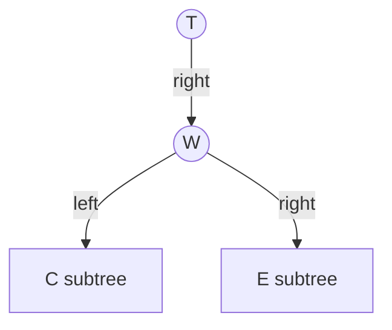
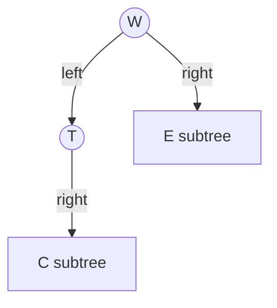
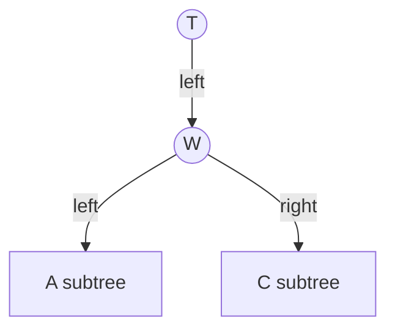
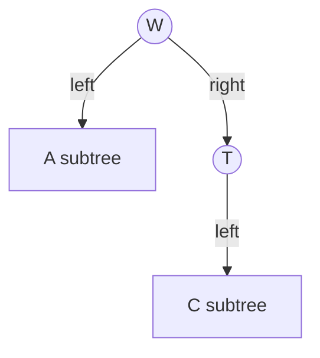
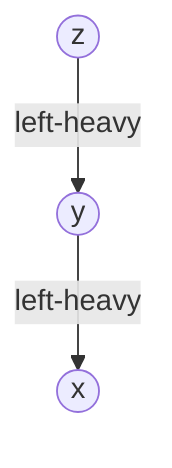
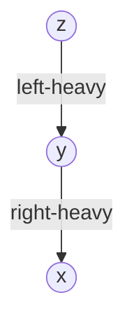
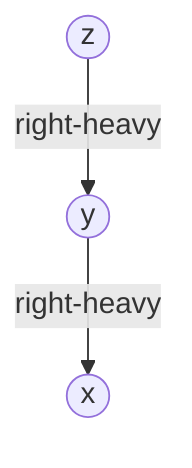
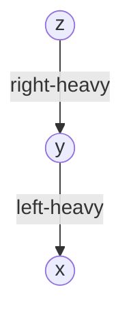

# AVL Rotations

> [!summary]
> Rotation 是 AVL 恢复平衡的核心操作。  
> 它只改变局部父子关系，不改变 inorder 顺序，因此不会破坏 BST property。

## rotateLeft(T)

前提：`T.right != null`。

Before:



After:



```text
    T                 W
     \               / \
      W     ==>     T   E
     / \             \
    C   E             C
```

`C` 会从 `W.left` 变成 `T.right`。由于原本有 `T < C < W`，旋转后顺序仍然合法。

> [!tip] Implementation Jump
> 完整代码看 [[09-4 Cpp AVL Rotations and Rebalance#rotateLeft|C++ rotateLeft]]。

## rotateRight(T)

前提：`T.left != null`。

Before:



After:



```text
      T             W
     /             / \
    W      ==>    A   T
   / \               /
  A   C             C
```

这是 `rotateLeft` 的镜像。

> [!tip] Implementation Jump
> 完整代码看 [[09-4 Cpp AVL Rotations and Rebalance#rotateRight|C++ rotateRight]]。

## Four AVL Cases

| Case | Condition | Fix |
|---|---|---|
| Left Left | `bf(x) = +2` and `bf(x.left) >= 0` | `rotateRight(x)` |
| Left Right | `bf(x) = +2` and `bf(x.left) < 0` | `rotateLeft(x.left)`, then `rotateRight(x)` |
| Right Right | `bf(x) = -2` and `bf(x.right) <= 0` | `rotateLeft(x)` |
| Right Left | `bf(x) = -2` and `bf(x.right) > 0` | `rotateRight(x.right)`, then `rotateLeft(x)` |

插入时常见教材会写成 `+1/-1` 判断；实现中用 `>= 0`、`<= 0` 可以同时覆盖删除后的边界情况。

### Left Left Case



Fix: `rotateRight(z)`.

### Left Right Case



Fix: first `rotateLeft(y)`, then `rotateRight(z)`.

### Right Right Case



Fix: `rotateLeft(z)`.

### Right Left Case



Fix: first `rotateRight(y)`, then `rotateLeft(z)`.

> [!tip] Implementation Jump
> 四种 case 的统一处理看 [[09-4 Cpp AVL Rotations and Rebalance#Rebalance|C++ Rebalance]]。

## Rotation Pseudocode

```cpp
Node* rotateLeft(Node* x) {
    Node* y = x->right;
    Node* beta = y->left;

    y->parent = x->parent;
    x->right = beta;
    if (beta != nullptr) beta->parent = x;

    y->left = x;
    x->parent = y;

    refresh(x);
    refresh(y);
    return y;
}
```

真实代码还必须处理：

- `x` 原来是不是 root。
- `x` 是 parent 的 left child 还是 right child。
- rotation 后更新 height 和 size。

完整实现见 [[09-4 Cpp AVL Rotations and Rebalance#rotateLeft|rotateLeft]]、[[09-4 Cpp AVL Rotations and Rebalance#rotateRight|rotateRight]] 和 [[09-4 Cpp AVL Rotations and Rebalance#Rebalance|rebalanceFrom]]。

## Insert vs Remove

- AVL insert: 第一个失衡点修好后，整棵树通常就恢复平衡。
- AVL remove: 删除可能让多个祖先连续变矮，所以可能一路触发多个 rotation。

## Links

- Back to [[Binary Search Tree]]
- Previous: [[06 AVL Tree and Balance]]
- Next: [[08 Traversal Rank Select]]
- Related: [[05 Complexity and Height]]
- Related: [[BST AVL Cheat Sheet]]
