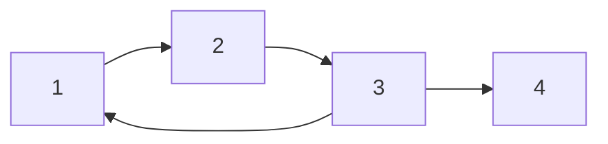

---

## 1. Core Idea 

在 **有向图（Directed Graph）** 中，判环最经典的方法是 **DFS + 三色标记（3-color DFS）**。

我们把每个点分成三种状态：

- `0 = unvisited`：还没访问过
- `1 = visiting`：当前 DFS 递归栈中，正在访问
- `2 = visited`：已经访问完成，已经退出递归栈

### 为什么这样能判环？

如果在 DFS 过程中，从当前节点 `u` 访问某个邻居 `v` 时，发现 `v` 的状态是 `1`，  
说明 `v` 还在当前递归路径上，也就是说：

> 我们从当前路径又回到了路径上的某个祖先节点

这就说明图中存在 **有向环（cycle）**。

---

## 2. Key Observation 

> [!important]
> 在有向图中，**出现一条指向“正在访问中的节点”的边**，就说明存在环。

也就是：

- 遇到 `color[v] == 1`
- 就表示发现了 **back edge（返祖边）**
- 因而图中有环

---

## 3. Visual Intuition 

下面这个图中存在一个环：`1 -> 2 -> 3 -> 1`



### DFS 访问过程示意

假设从 `1` 开始 DFS：

1. 访问 `1`，标记为 `visiting`
2. 访问 `2`，标记为 `visiting`
3. 访问 `3`，标记为 `visiting`
4. 从 `3` 再访问到 `1`
5. 发现 `1` 仍然是 `visiting`

所以说明：  
`1` 还在当前递归路径中，形成了环。

---
## 4. Image of a Cycle Detection


![[cycle-detection-dg-example.png]]
---

## 5. Algorithm 

### DFS 判环步骤

对于每个还没访问过的节点 `u`：

1. 标记 `u = visiting`
2. 遍历所有邻居 `v`
   - 如果 `v == unvisited`，递归 DFS(v)
   - 如果 `v == visiting`，说明有环
3. 所有邻居处理完后，标记 `u = visited`

---

## 6. C++ Implementation

```cpp
#include <bits/stdc++.h>
using namespace std;

class Solution {
public:
    bool hasCycle(int n, vector<vector<int>>& adj) {
        vector<int> color(n, 0); // 0 = unvisited, 1 = visiting, 2 = visited

        function<bool(int)> dfs = [&](int u) {
            color[u] = 1; // entering recursion stack

            for (int v : adj[u]) {
                if (color[v] == 0) {
                    if (dfs(v)) return true;
                } 
                else if (color[v] == 1) {
                    // found a back edge -> cycle exists
                    return true;
                }
            }

            color[u] = 2; // finished exploring
            return false;
        };
		//graph may not be continued, e.g. {0 1 2 0 3} {4 5}
        for (int i = 0; i < n; i++) {
            if (color[i] == 0) {
                if (dfs(i)) return true;
            }
        }

        return false;
    }
};

int main() {
    int n = 4;
    vector<vector<int>> adj(n);

    // Example:
    // 0 -> 1 -> 2 -> 0 forms a cycle
    // 2 -> 3
    adj[0].push_back(1);
    adj[1].push_back(2);
    adj[2].push_back(0);
    adj[2].push_back(3);

    Solution sol;
    if (sol.hasCycle(n, adj)) {
        cout << "Graph contains a cycle\n";
    } else {
        cout << "Graph does not contain a cycle\n";
    }

    return 0;
}
```

---

## 7. Code Explanation 

### `color[u] = 1`
表示当前节点 `u` 正在 DFS 中，也就是它在递归栈里。

### `if (color[v] == 0)`
表示邻居 `v` 还没访问过，需要继续深入搜索。

### `else if (color[v] == 1)`
这是最关键的一步。  
如果邻居 `v` 已经在递归栈里，那么当前边 `u -> v` 就把我们带回了当前搜索路径上的祖先节点，因此有环。

### `color[u] = 2`
表示 `u` 的所有出边都已经处理完，可以安全退出递归栈。

---

## 8. Complexity 

每个点最多访问一次，每条边最多检查一次，所以：

- **Time Complexity**: `O(V + E)`
- **Space Complexity**: `O(V)`

其中：

- `V` = number of vertices
- `E` = number of edges

---

## 9. Common Pitfalls 

> [!warning]
> **Pitfall 1:** 不要把有向图判环和无向图判环混在一起。  
> 无向图常常通过“访问过且不是父节点”来判断；  
> 但有向图不是这样，必须关注 **递归栈 / visiting 状态**。

> [!warning]
> **Pitfall 2:** `visited` 不等于 “有环”。  
> 只有访问到 `visiting` 节点，才说明有环。  
> 访问到 `visited` 节点只是说明那部分已经处理过，不一定有问题。

> [!warning]
> **Pitfall 3:** 图可能不是连通的。  
> 所以必须从每个 `unvisited` 节点都尝试 DFS。

---

## 10. Extra Method ：Topological Sort 也能判环

除了 DFS 三色标记，还可以用 **Kahn’s Algorithm（拓扑排序）** 判环。

### 思想

- 如果一个有向图是 DAG，就一定能做出完整拓扑序
- 如果最后加入拓扑序的节点数 `< n`
- 说明有些节点永远无法入队
- 这意味着图中存在环

### 结论

- **能拓扑排序完所有点** -> 无环
- **不能处理完所有点** -> 有环

### CPP Implementation

```cpp
#include <bits/stdc++.h>
using namespace std;
class Solution{
    public:
        // Kahn Algo
        bool hasCycle(int n, vector<vector<int>> adj){
            vector<int> indegree(n,0);
            for(int i = 0; i < n; i++){
                for(int v : adj[i]){
                    indegree[v]++;
                }
            }
            queue<int> q;
            for(int i = 0; i < n; i++){
                if(indegree[i] == 0){
                    q.push(i);
                }
            }
            int processedCount = 0;
            while(!q.empty()){
                int u = q.front();
                q.pop();
                processedCount++;
                for(int v : adj[u]){
                    indegree[v]--;
                    if(indegree[v] == 0){
                        q.push(v);
                    }
                }
            }
            return processedCount != n;
        }
};
int main(){
    vector<vector<int>> G(4);
    G[0].push_back(1);
    G[1].push_back(2);
    G[2].push_back(3);
    G[2].push_back(0);
    Solution s;
    if(s.hasCycle(4,G)){
        cout << "HAS" << endl;
    }
    return 0;
}
```

---
