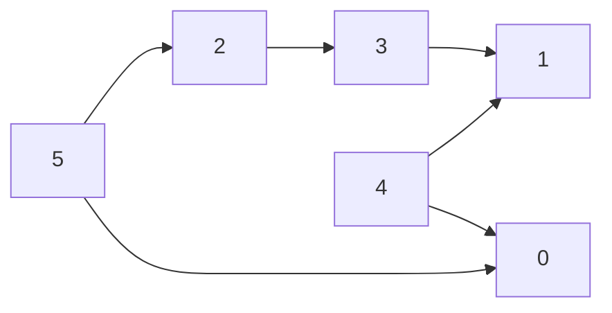

---
tags:
  - algorithm
  - graph
  - dfs
  - bfs
  - topological-sort
  - kahn
aliases:
  - Topological Sort
  - 拓扑排序
---

---

# Topological Sort（拓扑排序）

> [!info] 定义
> **Topological Sort** 是对一个 **DAG（Directed Acyclic Graph，有向无环图）** 的顶点进行线性排序，使得  
> 对每一条有向边 `u -> v`，顶点 `u` 都排在 `v` 前面。

---

## 1. 什么时候能做拓扑排序？

> [!important]
> 只有 **有向无环图 DAG** 才能进行拓扑排序。  
> 如果图中有环，就不存在合法的拓扑序。

### 例子
若有边：

- `A -> B`
- `A -> C`
- `B -> D`
- `C -> D`

那么一个合法拓扑序可以是：

- `A, B, C, D`
- `A, C, B, D`

---

## 2. 拓扑排序的核心思想

拓扑排序本质上是在满足依赖关系下安排顺序。

- 若 `u -> v`，说明：
  - `u` 是 `v` 的前置条件
  - `v` 必须在 `u` 之后出现

所以拓扑排序常用于：

- 课程先修关系
- 任务调度
- 编译依赖
- DAG 上的动态规划

---

# 3. 两种经典做法

1. DFS 实现拓扑排序  
2. Kahn Algorithm（基于入度，BFS 风格）

---

# 4. DFS 做 Topological Sort

## 4.1 核心思想

> [!tip]
> DFS 拓扑排序的关键思想是：  
> **一个点要在它所有后继节点都处理完之后，再加入答案。**

也就是：

- 先一路 DFS 到底
- 回溯时把当前节点加入结果
- 最后把结果反转，得到拓扑序

---

## 4.2 为什么回溯后加入是对的？

因为如果有边 `u -> v`：

- DFS 访问 `u` 时，会先递归访问 `v`
- `v` 会先完成
- `u` 会后完成

所以在“完成时间”顺序里：

- `v` 在前
- `u` 在后

把这个完成顺序 **反转** 后，就变成：

- `u` 在前
- `v` 在后

这正是拓扑排序需要的顺序。

---

## 4.3 DFS 

```cpp
vector<int> topo;
vector<int> state; 
// 0 = unvisited, 1 = visiting, 2 = visited

bool dfs(int u) {
    state[u] = 1; // 正在访问

    for (int v : adj[u]) {
        if (state[v] == 0) {
            if (!dfs(v)) return false; // 发现子树有环 递归传递信息
        } else if (state[v] == 1) {
            return false; // 发现环
        }
    }

    state[u] = 2; 
    topo.push_back(u); // 回溯时加入
    return true; //无环
}

bool topological_sort_dfs(int n) {
    state.assign(n, 0);
    topo.clear();

    for (int i = 0; i < n; i++) {
        if (state[i] == 0) {
            if (!dfs(i)) return false; //graph is not acyclic, there is no topological sort 
        }
    }

    reverse(topo.begin(), topo.end());
    return true;
}
```

---

## 4.4 DFS 检测环的方法

> [!warning]
> DFS 做拓扑排序时，必须检查是否有环。

常用三色标记：

- `0`：未访问
- `1`：正在访问（在递归栈中）
- `2`：访问完成

若从当前点走到一个 `state = 1` 的点，说明出现了 **back edge（返祖边）**，图中有环。

---

## 4.5 DFS 方法特点

### 优点
- 逻辑和 DFS 框架结合自然
- 同时可以顺便做环检测
- 适合递归思维

### 缺点
- 递归太深可能爆栈

---

# 5. Kahn Algorithm 做 Topological Sort

## 5.1 核心思想

> [!tip]
> Kahn 算法每次找 **入度为 0** 的点加入答案。  
> 因为入度为 0 说明它没有前置依赖，可以最先放。

流程：

1. 统计每个点的入度
2. 把所有入度为 0 的点放入队列
3. 每次取出一个点加入拓扑序
4. 删除它的出边，使其邻居入度减 1
5. 如果某个邻居入度变成 0，就加入队列
6. 重复直到队列为空

---

## 5.2 Kahn Algo

```cpp
vector<int> topological_sort_kahn(int n) {
    vector<int> indegree(n, 0);
    vector<int> topo;
    queue<int> q;

    for (int u = 0; u < n; u++) {
        for (int v : adj[u]) {
            indegree[v]++;
        }
    }

    for (int i = 0; i < n; i++) {
        if (indegree[i] == 0) q.push(i);
    }

    while (!q.empty()) {
        int u = q.front();
        q.pop();
        topo.push_back(u);

        for (int v : adj[u]) {
            indegree[v]--;
            if (indegree[v] == 0) {
                q.push(v);
            }
        }
    }

    if ((int)topo.size() != n) {
        return {}; // 有环，无法得到完整拓扑序
    }

    return topo;
}
```

---

## 5.3 为什么 Kahn 能检测环？

> [!important]
> 如果图中有环，那么环上的每个点至少都会有一个来自环内的入边。  
> 所以这些点的入度永远不可能变成 0。

因此：

- 若最终加入答案的点数 `< n`
- 说明还有点没被处理
- 这些剩余点必然处在环中，或受环影响

---

## 5.4 Kahn 方法特点

### 优点
- 非递归，不怕爆栈

### 缺点
- 需要额外维护入度数组


---

# 7. 一个完整例子

设图如下：

- `5 -> 2`
- `5 -> 0`
- `4 -> 0`
- `4 -> 1`
- `2 -> 3`
- `3 -> 1`

---

## 7.1 图示



---

## 7.2 用 Kahn 算法分析

### 初始入度

- `0: 2`（来自 5, 4）
- `1: 2`（来自 4, 3）
- `2: 1`（来自 5）
- `3: 1`（来自 2）
- `4: 0`
- `5: 0`

初始队列：

- `[4, 5]`

### 过程

1. 取出 `4`，答案：`[4]`
   - `0` 入度变 1
   - `1` 入度变 1

2. 取出 `5`，答案：`[4, 5]`
   - `2` 入度变 0，入队
   - `0` 入度变 0，入队

3. 取出 `2`，答案：`[4, 5, 2]`
   - `3` 入度变 0，入队

4. 取出 `0`，答案：`[4, 5, 2, 0]`

5. 取出 `3`，答案：`[4, 5, 2, 0, 3]`
   - `1` 入度变 0，入队

6. 取出 `1`，答案：`[4, 5, 2, 0, 3, 1]`

得到一个合法拓扑序：

`[4, 5, 2, 0, 3, 1]`

---

## 7.3 用 DFS 思考

若从 `5` 开始 DFS：

- `5 -> 2 -> 3 -> 1`
- 回溯加入：`1, 3, 2`
- 再处理 `0`
- 最后加入 `5`

类似地处理 `4`

最后把完成顺序反转，就得到一个合法拓扑序。

---

# 8. 时间复杂度

两种算法时间复杂度都是：

$$
O(V + E)
$$

其中：

- `V` = 顶点数
- `E` = 边数

因为每个点、每条边都只会被处理有限次。

---

# 9. 深层次理解：

无环” 和 “有拓扑序” 在 DAG 里是等价的，但：

- **判环算法**只需要回答：有/没有
- **拓扑排序算法**需要回答：具体顺序是什么

所以它不只是“返回值反过来”，而是：

- 失败条件相同：发现环
- 成功时多做一步：输出顺序